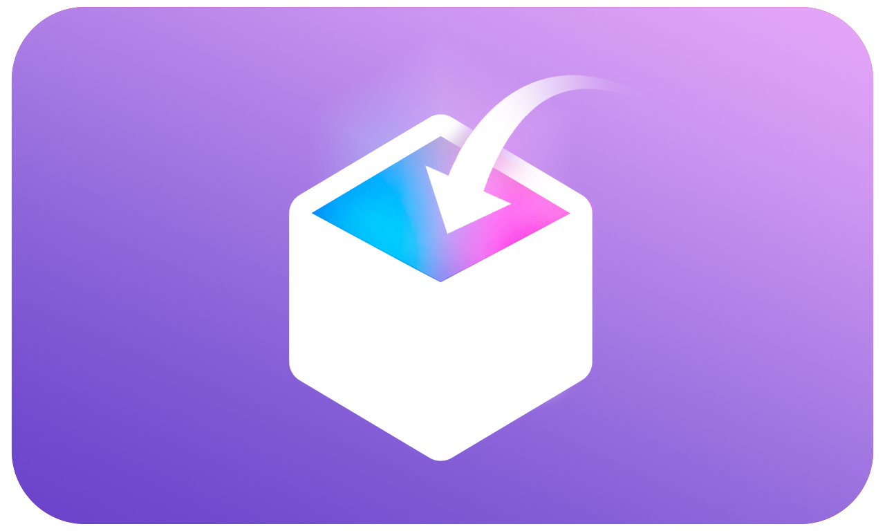

    </img>

<h1 align="center">TrollAppsTV</h1>
<h6 align="center">An App Store alternative built for tvOS.</h6>

# What is TrollAppsTV?
TrollAppsTV is an alternative to the tvOS App Store for TrollStore-tvOS users. TrollAppsTV allows users to download apps from repositories and install them directly in TrollStore. **TrollApps works on tvOS 14.0 beta 1 and up; make sure to be on the latest version of TrollStore.**

# Requirements
You must have TrollStore-tvOS installed on your AppleTV either through misaka, TrollHelper, or any other methods such as using palera1n. You must also have schema URLs enabled via TrollStore.

#

    </img>
    </img>
    </img>

#

# Found a bug / want to send feedback? 
<h3>Join our <a href="https://discord.gg/PrF6XqpGgX">Discord</a>!</h3>